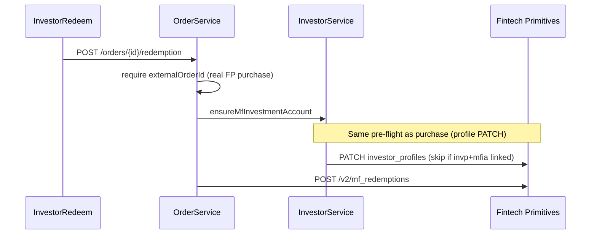

# Platizio Cybrilla Integration — Pending Work (2026-06-08)

Use with [onboarding-and-orders.md](onboarding-and-orders.md), [docs-index.md](docs-index.md), and official FP/POA docs.

## Recurring errors — root causes (2026-06-11)

| Symptom | Real cause | Not the cause |
|---------|------------|---------------|
| `occupation is already set and cannot be modified` | FP hides `occupation` on GET but stores it; order-ready PATCH must **not** send occupation on existing `invp_` profiles | Anita / demo investor "not ready" |
| Same error after code fix | Old JVM still bound to **8081**; `spring-boot:run` failed with "Port 8081 was already in use" | Frontend or Cybrilla catalogue |
| `occupation is mandatory for FATCA` | Brand-new FP profile missing occupation on **POST create** (different investor / earlier attempt) | POA scheme catalogue |
| Invest Now disabled (historical) | Ledger used OMS `fund_schemes` + `local=true` | Missing Cybrilla products |

**Ops rule:** After backend code changes, stop the process on 8081 once, then start a single `spring-boot:run`.

## Critical path for demo tomorrow

| # | Item | Status | Owner surface |
|---|------|--------|---------------|
| 1 | Ledger loads **POA** catalogue (`mf_scheme_plans/cybrillapoa`), not OMS `fund_schemes` | Fixed in `Ledger.tsx` | Frontend |
| 2 | Backend running on **8081** (`mvnw spring-boot:run`) | Verify manually | Ops |
| 3 | Order placement requires FP `invp_` profile + `mfia_` account | Auto-created on first order; use **Anita Verma** or sync investor | Backend + Investors UI |
| 4 | MF account duplicate resolve when FP list omits `primary_investor` | Fixed in `RealCybrillaClient.findMfInvestmentAccountId` | Backend |
| 5 | Lumpsum E2E: create order → investor action → consent → payment → SUCCESSFUL | Partially built | Backend `InvestorActionService` + investor-action HTML |

## Lumpsum purchase (FP cybrillapoa gateway)

Official sequence (see FP overview + purchase guides):

1. `POST /v2/mf_purchases` — order enters **under_review**
2. Poll until **pending** (review passed)
3. Investor **consent** update on purchase
4. **Confirm** purchase → poll until **submitted** (cybrillapoa gateway)
5. `POST /api/pg/payments/netbanking` with AMC `old_id`, `postback_url`
6. Redirect investor to payment `token_url`
7. Postback / webhook → finalize purchase → poll until **successful**

**Built:** steps 1–6 in `OrderService` + `InvestorActionService.submitPurchaseForPayment` (consent → confirm → submitted poll → payment); sandbox simulate on investor-action page.

**Pending:**

- [ ] Payment postback URL reachable in dev (`app.payment.postback-url` → backend `/investor-actions/{token}/payment-postback`)
- [ ] Webhook handlers for `mf_purchase` / `payment` events (idempotent reconcile)
- [ ] Payment retry UI when payment fails but order stays submitted (FP payment-retry guide)
- [ ] Portfolio holdings refresh after SUCCESSFUL (verify `DashboardService` / holdings poll)
- [ ] Custom UPI checkout path (optional; FP custom-checkout doc)

## Redemptions

Platizio: `POST /api/v1/orders/{purchaseOrderId}/redemption` → `OrderService.createRedemption`.

**Why redemption showed the same occupation error:** not a separate redemption bug — `createRedemption` always called `ensureMfInvestmentAccount`, which PATCHes the investor profile before FP ever sees the redemption request.

**Fixes:** no occupation on order-ready/update PATCH; skip profile prep when `invp_`+`mfia_` already linked at entry.

**Pending:** redemption consent/review polling UI; webhook reconcile; demo seeder orders (`fp_purchase_demo_*`) are not redeemable on live FP.

## SIP + mandate (distinct from lumpsum)

Official sequence (mandate use-cases doc):

1. Create **mandate** against verified bank `old_id`
2. **Authorize** mandate → `token_url` (NACH)
3. Postback → mandate **APPROVED** (sandbox: simulate)
4. Create **mf_purchase_plan** linked to mandate
5. Plan review → consent → confirm
6. First installment **NACH payment** (`createNachPayment`)

**Built:** `InvestorActionService` SIP branch; defer provider submit in `OrderService` for SIP+MANDATE.

**Pending:**

- [ ] Full mandate postback E2E on 8081 (real FP redirect, not only sandbox simulate)
- [ ] SIP plan review polling timeouts UX
- [x] SIP dashboard: only **established** SIPs (`ACTIVE`/`SUCCESSFUL`/`COMPLETED`/terminal) in main list; in-flight setup in `pendingSetup` bucket
- [x] Investor-action sandbox: **Simulate Mandate Approval** button (`POST /investor-actions/{token}/sandbox/simulate-mandate`)
- [x] Portfolio **SIP Mandates** section (`sipMandates` on portfolio API); holdings exclude in-flight SIP until `ACTIVE`
- [x] Cancel SIP: `POST /orders/{id}/cancel` → FP `POST /v2/mf_purchase_plans/cancel` with `{id, cancellation_code}`; local `CANCELLED` (never soft-delete). `DELETE` on SIP is rejected.
- [ ] Skip installment flow (FP skip-installment API)
- [x] Portfolio API: `GET /dashboard/distributor/{id}/portfolio` — unknown fund → Payment Failed, AUM from SUCCESSFUL/ACTIVE/COMPLETED only

## Onboarding & identity

| Area | FP / POA API | Platizio | Gap |
|------|--------------|----------|-----|
| PAN pre-verify | `POST /poa/pre_verifications` | `InvestorKycService` | Working |
| KYC check | POA pre_verifications | Onboarding step 1 | Working |
| KYC application | `/v2/kyc_requests` + identity docs | `InvestorKycModify` | Digilocker/eSign sandbox simulate |
| Bank BAV | POA pre_verifications (bank_accounts) | Bank capture + scheduler | Rahul = pending; Anita = verified locally |
| Investor profile | `/v2/investor_profiles` | Created after KYC | Demo rows often have **null** `cybrilla_investor_id` until first sync/order |
| MF investment account | `/v2/mf_investment_accounts` | `ensureMfInvestmentAccount` | Duplicate resolve improved |
| Folio defaults | PATCH mf_investment_accounts | `ensureMfInvestmentAccountOrderReady` | Needs email/phone/address/bank on profile |

**Pending:**

- [ ] `POST /investors/sync-from-cybrilla` button prominence in Investors UI before first order
- [ ] Transaction-eligible search should surface `externalSyncMessage` when profile pending
- [ ] Pre-verifications doc: all lookup types used in prod readiness checklist

## Product catalogue

| Source | Use for | Do NOT use for |
|--------|---------|----------------|
| `GET /v2/mf_scheme_plans/cybrillapoa` | **Orders** (ISIN) | — |
| `GET /api/oms/fund_schemes` | Admin reference / NAV metadata only | Order placement |

**Pending:**

- [ ] ProductMgmt still defaults to OMS sync — align with Ledger POA browse or label clearly "reference only"
- [ ] Scheme min SIP/lumpsum from `thresholds` in plan metadata (partially in `readSchemeMinSip`)

## Auth & tokens

- Two audiences: `CYBRILLA_PRE_VERIFICATION` (POA), `FINPRIM_TENANT` (`/v2/...`)
- 30-minute JWT refresh with single 401 retry
- Frontend: `VITE_API_BASE_URL=http://localhost:8081/api/v1` only

## Sandbox test data (quick reference)

- Login: `a@a.com` / `Ok@123456`
- Distributor: `4317cfd2-a41f-4320-a5dc-26835c7210ac`
- **Anita Verma** `9b5c4d3e-2f1a-4c0b-9d8e-7f6a5b4c3d03` — KYC + bank verified (sync FP profile on first order)
- Payment amount ending **0** → success; ending **1** → failure
- Bank account ending **1193** for sandbox BAV

## Investor-action pages

Served by Spring Boot at `{BACKEND_ORIGIN}/investor-actions/{token}` — **not** Vite :3000.

**Pending:**

- [ ] Confirm `buildInvestorActionUrl` in frontend uses backend origin from `api.ts`
- [x] Investor-action HTML: sandbox **Simulate Mandate Approval** for SIP+MANDATE (`sandboxMandateSimulationAllowed`)
- [x] Investor-action HTML: sandbox **Simulate Payment** for lumpsum / post-mandate NACH (`sandboxPaymentSimulationAllowed`)

## Documentation sources (always re-check before coding)

- POA pre-verifications: https://poa.cybrilla.com/docs/additional-apis/pre-verifications
- FP cybrillapoa API: https://fintechprimitives.com/docs/api/cybrillapoa/#introduction
- FP gateway overview: https://docs.fintechprimitives.com/fp-cybrillapoa-gateway/overview/
- Sandbox simulation: https://docs.fintechprimitives.com/fp-cybrillapoa-gateway/sandbox-simulation
