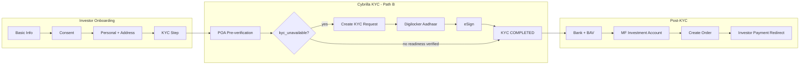

# Platizio demo — sandbox transaction workflow plan

**Goal:** One successful **sandbox lump-sum MF purchase** for Cybrilla product demo **this week**.

**Environment:** `CYBRILLA_ENVIRONMENT=sandbox`, `s.finprim.com`, `api.sandbox.cybrilla.com`, `*_test_*` credentials.

---

## Critical blocker (fix first)

Your backend JVM may still be using **old `.env`** (logs showed `api.fintechprimitives.com`).

```powershell
# Stop running spring-boot, then:
Remove-Item "$env:USERPROFILE\.platizio-wealthtech\external-auth-token-cache.json" -ErrorAction SilentlyContinue
.\mvnw.cmd spring-boot:run
```

Confirm startup log shows `finprim_base_url='https://s.finprim.com'` and token URL `s.finprim.com`.

---

## Demo story (recommended: Path B — full KYC)

**Path A — Fast transaction (5 min demo)**  
PAN `AAAPA3751A` (KYC-ready) → bank `...1193` → order ₹5000 (ends in 0).

**Path B — Full Cybrilla story (15 min demo, best for product review)**  
PAN `BBBPB3753B` (**kyc_unavailable**) → fresh KYC → Digilocker → eSign → bank → order.

Use **Path B** if Cybrilla cares about KYC UX. Use **Path A** if you only need “money moved”.

---

## End-to-end flow (backend + frontend)



| Step | Backend API | Frontend screen |
|------|-------------|-----------------|
| 1 Create investor | `POST /investors` | Onboarding step 1–3 |
| 2 Pre-verification | `POST /investors/{id}/kyc-checks` | KYC step — Run pre-verification |
| 3 KYC request | `POST /investors/{id}/kyc-requests` or `kyc-flow/advance` | Auto when `kyc_unavailable` |
| 4 Aadhaar | `POST /identity-documents` | Open Digilocker link |
| 5 eSign | `POST /esign/start` | Open eSign link |
| 6 Bank | `POST /bank-accounts` + refresh BAV | Onboarding step 5 |
| 7 Products | `GET /products/schemes` | Product Mgmt / order screen |
| 8 Order | `POST /orders` | Transactions |
| 9 Pay | `GET /investor-actions/{token}` | Payment redirect |

---

## Week schedule

### Day 1 — Environment + happy path (Path A)

- [ ] Restart backend with sandbox `.env`, clear token cache
- [ ] Verify token logs: `s.finprim.com` not `api.fintechprimitives.com`
- [ ] Create investor **DEMO-KYC-READY** (`AAAPA3751A`) from `sandbox-test-matrix-full.csv`
- [ ] Pre-verification → readiness `verified`
- [ ] Bank ending `1193` → BAV verified
- [ ] Pick ABSL/Ipru scheme from live catalogue
- [ ] Order ₹**5000** (ends in 0) → payment redirect

### Day 2 — Full KYC path (Path B) — **demo centerpiece**

- [ ] Investor **DEMO-KYC-UNAVAILABLE** (`BBBPB3753B`)
- [ ] Pre-verification → `readiness.code = kyc_unavailable`
- [ ] Walk `kyc-flow/status` + **Run next step** through:
  - CREATE_KYC_REQUEST → START_AADHAAR → REFRESH → START_ESIGN → COMPLETE
- [ ] Sandbox: use **Simulate success** on KYC request if Digilocker unavailable in room
- [ ] Bank + order as Day 1

### Day 3 — Polish demo UX

- [ ] Sandbox demo guide panel visible on KYC step
- [ ] Pre-fill demo investor from guide “Use this investor” button
- [ ] Status chips: Pre-verification / KYC request / Aadhaar / eSign / Bank / Order
- [ ] Hide production-only controls; show sandbox banner

### Day 4 — Negative cases (optional slides)

- [ ] `DDDPI1234D` invalid PAN
- [ ] `EEEPE1234E` aadhaar_not_linked
- [ ] Bank `...1515` failure
- [ ] Order ₹500**1** failure

### Day 5 — Dry run + Cybrilla call

- [ ] Full Path B rehearsal recorded
- [ ] Send connectivity email if timeouts persist
- [ ] Backup: Path A recording if live Digilocker fails

---

## Backend checklist (demo-ready)

| Item | Status |
|------|--------|
| Sandbox URLs in `.env` | Done |
| `kyc-flow/status` + `advance` | Done |
| Personal before KYC (address required) | Done |
| Sandbox simulate guarded | Done |
| Token cache + 120s buffer | Done |
| Products from Cybrilla catalogue | Done |
| **Restart JVM after .env change** | **YOU** |

---

## Frontend checklist (demo-ready)

| Item | Status |
|------|--------|
| Step order: Personal → KYC | Done |
| Digilocker/eSign redirect links | Done |
| Sandbox demo guide panel | Added |
| `kyc-flow` status + next action labels | Done |
| API base `localhost:8081` | Verify in frontend `.env` |

---

## Demo talking points for Cybrilla

1. “All Cybrilla calls go through our Spring Boot layer — browser never sees tokens.”
2. “We use POA pre-verification first; when readiness returns `kyc_unavailable`, we orchestrate FP KYC request → identity document → eSign.”
3. “Investor state is persisted with `pv_`, `kycr_`, `iddoc_`, `mfia_` external IDs for retry and schedulers.”
4. “Sandbox simulator PANs drive deterministic outcomes for QA and this demo.”

---

## Files

- Full test data: `sandbox-test-matrix-full.csv`
- Quick copy scenarios: `sandbox-demo-scenarios.md`
- Connectivity email: `cybrilla-demo-support-email.md`
